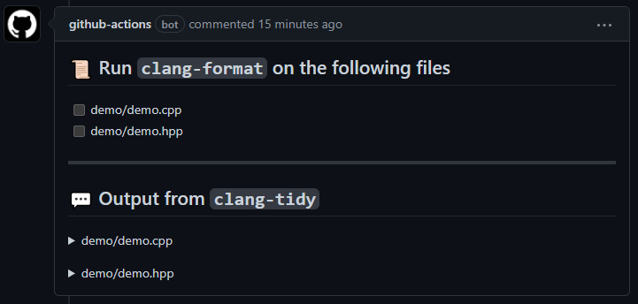

<p align="center">

</p>
<!--intro-start-->

# C/C++ Lint Action <sub><sup>| clang-format & clang-tidy</sup></sub>


[](https://github.com/shenxianpeng/cpp-linter-action/actions/workflows/cpp-linter.yml)

[](https://cpp-linter-action.readthedocs.io/en/latest/?badge=latest)
[](https://gitpod.io/#https://github.com/shenxianpeng/cpp-linter-action)

Github Actions for linting C/C++ code. Integrated clang-tidy, clang-format check.

## Usage

Create a new GitHub Actions workflow in your project, e.g. at `.github/workflows/cpp-linter.yml`

The conetent of the file should be in the following format.

```yaml
name: cpp-linter

# Triggers the workflow on push or pull request events
on:
  push:
  pull_request:
    types: [opened]
jobs:
  cpp-linter:
    name: cpp-linter
    runs-on: ubuntu-latest
    steps:
      # It is best to checkout the repo before running cpp-linter-action
      - uses: actions/checkout@v2
      - name: C/C++ Lint Action
        env:
            GITHUB_TOKEN: ${{ secrets.GITHUB_TOKEN }}
        uses: shenxianpeng/cpp-linter-action@master
        with:
          style: 'file'
```

`GITHUB_TOKEN` - Provided by Github (see [Authenticating with the GITHUB_TOKEN](https://docs.github.com/en/actions/reference/authentication-in-a-workflow))

### Optional Inputs

| Name | Default | Description |
|------------|---------------|-------------|
| `style` | 'llvm' | The style rules to use. Set this to 'file' to have clang-format use the closest relative .clang-format file. |
| `extensions` | 'c,h,C,H,cpp,hpp,cc,hh,c++,h++,cxx,hxx' | The file extensions to run the action against. This is a comma-separated string. |
| `tidy-checks` | 'boost-\*,bugprone-\*,performance-\*,readability-\*,portability-\*,modernize-\*,clang-analyzer-\*,cppcoreguidelines-\*' | A string of regex-like patterns specifying what checks clang-tidy will use.|
| `repo-root` | '.' | The relative path to the repository root directory. This path is relative to path designated by the runner's GITHUB_WORKSPACE environment variable. |
| `version` | '10' | The desired version of the clang tools to use. Accepted options are strings which can be 6.0, 7, 8, 9, 10, 11, 12. |
| `diff-only` | 'false' | Set this option to 'true' to only analyse changes in the event's diff. |
| `verbosity` | '10' | This controls the action's verbosity in the workflow's logs. Supported options are defined by the python logging library's log levels. |

### Outputs

This action creates 1 output variable named `checks-failed`. Even if the linting checks fail for source files this action will still pass, but users' CI workflows can use this action's output to exit the workflow early if that is desired.

## Example
<!--intro-end-->

<!--footer-start-->
Example comment is [here](https://github.com/shenxianpeng/cpp-linter-action/pull/5#commitcomment-55252014).

## Have question or feedback?

To provide feedback (requesting a feature or reporting a bug) please post to [issues](https://github.com/shenxianpeng/cpp-linter-action/issues).


## License

The scripts and documentation in this project are released under the [MIT License](https://github.com/shenxianpeng/cpp-linter-action/blob/master/LICENSE)
<!--footer-end-->
