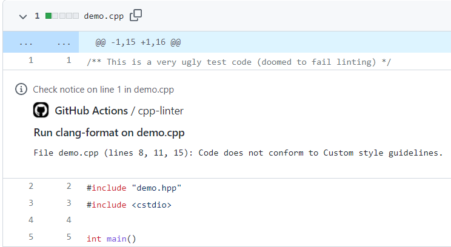
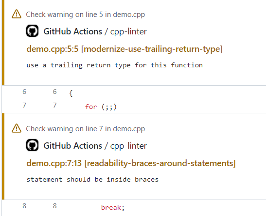
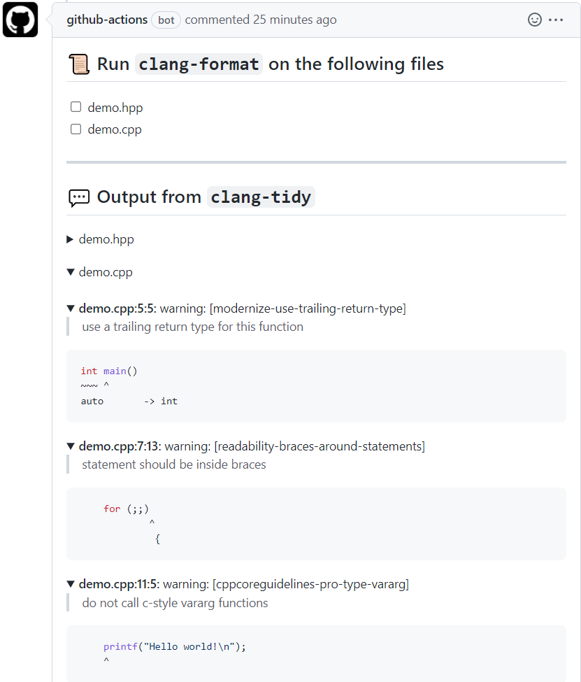

<p align="center">

</p>
<!--intro-start-->

# C/C++ Lint Action <sub><sup>| clang-format & clang-tidy</sup></sub>


[](https://github.com/marketplace/actions/c-c-lint-action)
[](https://github.com/cpp-linter/cpp-linter-action/actions/workflows/cpp-linter.yml)
[](https://github.com/cpp-linter/cpp-linter-action/actions/workflows/mkdocs-deploy.yml)

[](https://gitpod.io/#https://github.com/cpp-linter/cpp-linter-action)

A Github Action for linting C/C++ code integrating clang-tidy and clang-format to collect feedback provided in the form of thread comments and/or annotations.

## Usage

Create a new GitHub Actions workflow in your project, e.g. at [.github/workflows/cpp-linter.yml](https://github.com/cpp-linter/cpp-linter-action/blob/master/.github/workflows/cpp-linter.yml)

The content of the file should be in the following format.

```yaml
# Workflow syntax:
# https://help.github.com/en/articles/workflow-syntax-for-github-actions
name: cpp-linter

on:
  pull_request:
    types: [opened, reopened]  # let PR-synchronize events be handled by push events
  push:

jobs:
  cpp-linter:
    runs-on: ubuntu-latest
    steps:
      - uses: actions/checkout@v3
      - uses: cpp-linter/cpp-linter-action@v1
        id: linter
        env:
          GITHUB_TOKEN: ${{ secrets.GITHUB_TOKEN }}
        with:
          style: file

      - name: Fail fast?!
        if: steps.linter.outputs.checks-failed > 0
        run: |
          echo "Some files failed the linting checks!"
        # for actual deployment
        # run: exit 1
```

### Optional Inputs

#### `style`

- **Description**: The style rules to use. Set this to 'file' to have clang-format use the closest relative .clang-format file.
- Default: 'llvm'

#### `extensions`

- **Description**: The file extensions to run the action against. This is a comma-separated string.
- Default: 'c,h,C,H,cpp,hpp,cc,hh,c++,h++,cxx,hxx'

#### `tidy-checks`

- **Description**: Comma-separated list of globs with optional '-' prefix. Globs are processed in order of appearance in the list. Globs without '-' prefix add checks with matching names to the set, globs with the '-' prefix remove checks with matching names from the set of enabled checks. This option's value is appended to the value of the 'Checks' option in a .clang-tidy file (if any).
    - It is possible to disable clang-tidy entirely by setting this option to '-\*'. This allows using only clang-format to lint your source files.
    - It is also possible to rely solely on a .clang-tidy config file by specifying this option as a blank string ('').
- Default: 'boost-\*,bugprone-\*,performance-\*,readability-\*,portability-\*,modernize-\*,clang-analyzer-\*,cppcoreguidelines-\*'

#### `repo-root`

- **Description**: The relative path to the repository root directory. This path is relative to the path designated as the runner's GITHUB_WORKSPACE environment variable.
- Default: '.'

#### `version`

- **Description**: The desired version of the [clang-tools](https://hub.docker.com/r/xianpengshen/clang-tools) to use. Accepted options are strings which can be 14, 13, 12, 11, 10, 9, or 8.
- Default: '10'

#### `verbosity`

- **Description**: This controls the action's verbosity in the workflow's logs. Supported options are defined by the python logging library's log levels. This option does not affect the verbosity of resulting comments or annotations.
- Default: '10'

#### `lines-changed-only`

- **Description**: Set this option to true to only analyze changes in the event's diff.
- Default: false

#### `files-changed-only`

- **Description**: Set this option to false to analyze any source files in the repo.
- Default: true
- NOTE: The `GITHUB_TOKEN` should be supplied when running on a private repository with this option enabled, otherwise the runner does not not have the privilege to list changed files for an event. See [Authenticating with the GITHUB_TOKEN](https://docs.github.com/en/actions/reference/authentication-in-a-workflow)

#### `ignore`

- **Description**: Set this option with string of path(s) to ignore.
  - In the case of multiple paths, you can use a pipe character ('|')
    to separate the multiple paths. Multiple lines are forbidden as an input to this option; it must be a single string.
  - This can also have files, but the file's relative path has to be specified
    as well.
  - There is no need to use './' for each entry; a blank string ('') represents
    the repo-root path (specified by the `repo-root` input option).
  - Submodules are automatically ignored. Hidden directories (beginning with a '.') are also ignored automatically.
  - Prefix a path with a bang ('!') to make it explicitly _not_ ignored - order of
    multiple paths does _not_ take precedence. The '!' prefix can be applied to
    a submodule's path (if desired) but not hidden directories.
  - Glob patterns are not supported here. All asterisk characters ('\*') are literal.
- Default: '.github'

#### `thread-comments`

- **Description**: Set this option to false to disable the use of thread comments as feedback.
  - To use thread comments, the `GITHUB_TOKEN` (provided by Github to each repository) must be declared as an environment
    variable. See [Authenticating with the GITHUB_TOKEN](https://docs.github.com/en/actions/reference/authentication-in-a-workflow)
- Default: false
- NOTE: If run on a private repository, then this feature is disabled because the GitHub REST API behaves differently for thread comments on a private repository.

#### `file-annotations`

- **Description**: Set this option to false to disable the use of file annotations as feedback.
- Default: true

#### `database`

- **Description**: The directory containing compilation database (like compile_commands.json) file.
- Default: ''

### Outputs

This action creates 1 output variable named `checks-failed`. Even if the linting checks fail for source files this action will still pass, but users' CI workflows can use this action's output to exit the workflow early if that is desired.

## Running without the docker container

Some Continuous Integration environments require access to non-default compilers
and/or non-standard libraries. To do this properly, the docker container should
not be used due to it's isolated file system. Instead, you should use this action's
python source code as an installed python package (see below).

### Using the python source code

This action was originally designed to only be used on a runner with the Ubuntu
Operating System. However, this action's source code (essentially a python package)
can be used on any runner using the Windows, Ubuntu, or possibly even MacOS (untested)
virtual environments.

Note, some runners already ship with clang-format and/or clang-tidy. As of this writing, the following versions of clang-format and clang-tidy are already available:

- `ubuntu-latest` ships with v10, v11, and v12. [More details](https://github.com/actions/virtual-environments/blob/ubuntu20/20220508.1/images/linux/Ubuntu2004-Readme.md).
- `windows-latest` ships with v13. [More details](https://github.com/actions/virtual-environments/blob/win22/20220511.2/images/win/Windows2022-Readme.md).
- `macos-latest` ships with v13. [More details](https://github.com/actions/virtual-environments/blob/main/images/macos/macos-11-Readme.md).

This example makes use of another action
([KyleMayes/install-llvm-action](https://github.com/KyleMayes/install-llvm-action))
to install a certain version of clang-tidy and clang-format.

```yml
on:
  pull_request:
    types: [opened, reopened]  # let PR-synchronize events be handled by push events
  push:

jobs:
  cpp-linter:
    runs-on: windows-latest

    steps:
      - uses: actions/checkout@v3
      - uses: actions/setup-python@v3

      # this step can be skipped if the desired
      # version already comes with the runner's OS
      - name: Install clang-tools
        uses: KyleMayes/install-llvm-action@v1
        with:
          # v12 is the recommended minimum for the Visual Studio compiler (on Windows)
          version: 14
          # specifying an install path is required (on Windows) because installing
          # multiple versions on Windows runners needs non-default install paths.
          directory: ${{ runner.temp }}/llvm

      - name: Install linter python package
        run: python3 -m pip install git+https://github.com/cpp-linter/cpp-linter-action@v1

      - name: run linter as a python package
        id: linter
        # pass the installed path to the '--version' argument (Windows only).
        # Any other OS-based runners only take the version number.
        #     Example. run: cpp-linter --version=14
        # Omit the version option if using the default version available in the OS.
        run: cpp-linter --version=${{ runner.temp }}/llvm 

      - name: Fail fast?!
        if: steps.linter.outputs.checks-failed > 0
        run: echo "Some files failed the linting checks!"
        # for actual deployment
        # run: exit 1
```

All input options listed above are specified by pre-pending a `--`. You can also install this repo locally and run `cpp-linter -h` for more detail. For example:

```yaml
      - uses: cpp-linter/cpp-linter-action@v1
        with:
          style: file
          tidy-checks: '-*'
          files-changed-only: false
          ignore: 'dist/third-party-lib'
```

is equivalent to

```yaml
      - name: Install linter python package
        run: python3 -m pip install git+https://github.com/cpp-linter/cpp-linter-action@v1

      - name: run linter as a python package
        run: |
          cpp-linter \
          --style=file \
          --tidy-checks='-*' \
          --files-changed-only=false \
          --ignore='dist/third-party-lib'
```

## Example

<!--intro-end-->

### Annotations





### Thread Comment



<!--footer-start-->

## Used By

- [google/flatbuffers](https://github.com/google/flatbuffers) 
- [CHIP-SPV/chip-spv](https://github.com/CHIP-SPV/chip-spv) 
- [and more](https://github.com/search?q=shenxianpeng%2Fcpp-linter-action&type=Code)

## Add C/C++ Lint Action badge in README

You can show C/C++ Lint Action status with a badge in your repository README

Example

```markdown
[](https://github.com/cpp-linter/cpp-linter-action/actions/workflows/cpp-linter.yml)
```

[](https://github.com/cpp-linter/cpp-linter-action/actions/workflows/cpp-linter.yml)

## Have question or feedback?

To provide feedback (requesting a feature or reporting a bug) please post to [issues](https://github.com/cpp-linter/cpp-linter-action/issues).

## License

The scripts and documentation in this project are released under the [MIT License](https://github.com/cpp-linter/cpp-linter-action/blob/master/LICENSE)

<!--footer-end-->
