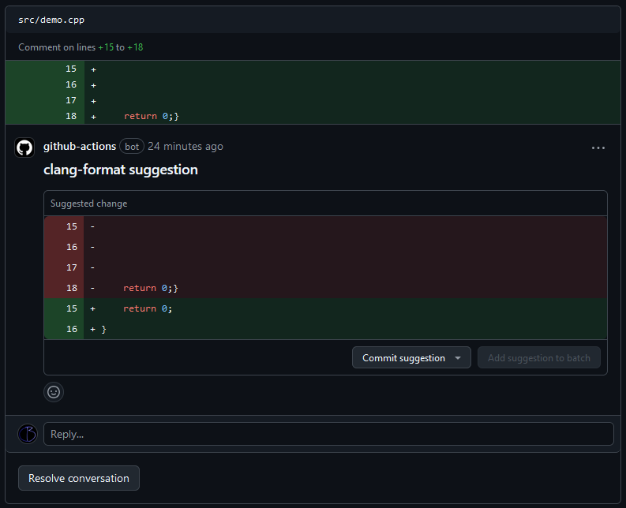

[file-annotations]: inputs-outputs.md#file-annotations
[thread-comments]: inputs-outputs.md#thread-comments
[step-summary]: inputs-outputs.md#step-summary
[tidy-review]: inputs-outputs.md#tidy-review
[format-review]: inputs-outputs.md#format-review

[io-doc]: inputs-outputs.md
[recipes-doc]: examples/index.md



## Example

### Annotations

Using [`--file-annotations`][file-annotations]:

#### clang-format annotations

{ .dark-only }
{ .light-only }

#### clang-tidy annotations

{ .dark-only }
{ .light-only }

### Thread Comment

Using [`--thread-comments`][thread-comments]:

{ .dark-only }
{ .light-only }

??? example "Expanded"

    { .dark-only }
    { .light-only }

### Step Summary

Using [`--step-summary`][step-summary]:

{ .dark-only }
{ .light-only }

### Pull Request Review

{ .dark-only }
{ .light-only }

#### clang-tidy suggestion

Using [`--tidy-review`][tidy-review]:

{ .dark-only }
{ .light-only }

#### clang-format suggestion

Using [`--format-review`][format-review]:

{ .dark-only }
{ .light-only }


